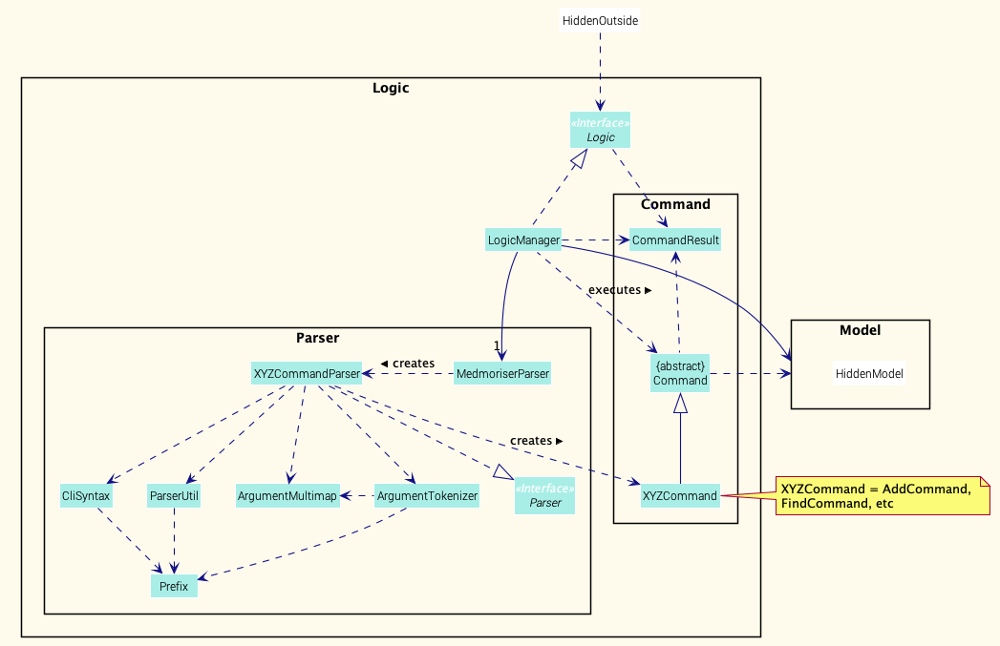
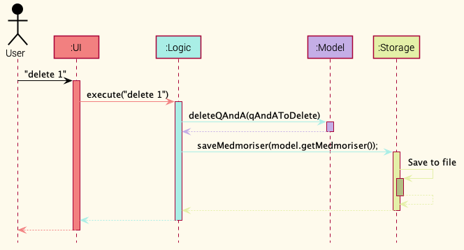
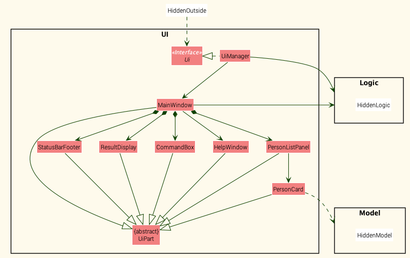
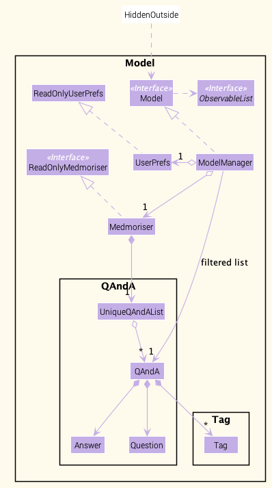
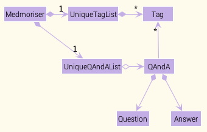
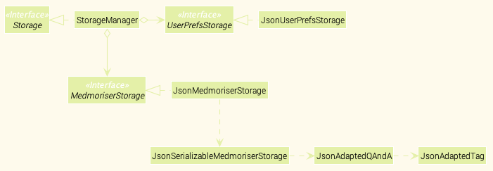

* Table of Contents
{:toc}

--------------------------------------------------------------------------------------------------------------------

## **Setting up, getting started**

Refer to the guide [_Setting up and getting started_](SettingUp.md).

--------------------------------------------------------------------------------------------------------------------

## **Design**

### Architecture

The ***Architecture Diagram*** given above explains the high-level design of the App. Given below is a quick overview of each component.

:bulb: **Tip:** The `.puml` files used to create diagrams in this document can be found in the [diagrams](https://github.com/se-edu/addressbook-level3/tree/master/docs/diagrams/) folder. Refer to the [_PlantUML Tutorial_ at se-edu/guides](https://se-education.org/guides/tutorials/plantUml.html) to learn how to create and edit diagrams.

**`Main`** has two classes called [`Main`](https://github.com/se-edu/addressbook-level3/tree/master/src/main/java/seedu/answer/Main.java) and [`MainApp`](https://github.com/se-edu/addressbook-level3/tree/master/src/main/java/seedu/answer/MainApp.java). It is responsible for,
* At app launch: Initializes the components in the correct sequence, and connects them up with each other.
* At shut down: Shuts down the components and invokes cleanup methods where necessary.

[**`Commons`**](#common-classes) represents a collection of classes used by multiple other components.

The rest of the App consists of four components.

* [**`UI`**](#ui-component): The UI of the App.
* [**`Logic`**](#logic-component): The command executor.
* [**`Model`**](#model-component): Holds the data of the App in memory.
* [**`Storage`**](#storage-component): Reads data from, and writes data to, the hard disk.

Each of the four components,

* defines its *API* in an `interface` with the same name as the Component.
* exposes its functionality using a concrete `{Component Name}Manager` class (which implements the corresponding API `interface` mentioned in the previous point.

For example, the `Logic` component (see the class diagram given below) defines its API in the `Logic.java` interface and exposes its functionality using the `LogicManager.java` class which implements the `Logic` interface.

**How the architecture components interact with each other**

The *Sequence Diagram* below shows how the components interact with each other for the scenario where the user issues the command `delete 1`.

The sections below give more details of each component.

### UI component

**API** :
[`Ui.java`](https://github.com/se-edu/addressbook-level3/tree/master/src/main/java/seedu/answer/ui/Ui.java)

The UI consists of a `MainWindow` that is made up of parts e.g.`CommandBox`, `ResultDisplay`, `PersonListPanel`, `StatusBarFooter` etc. All these, including the `MainWindow`, inherit from the abstract `UiPart` class.

The `UI` component uses JavaFx UI framework. The layout of these UI parts are defined in matching `.fxml` files that are in the `src/main/resources/view` folder. For example, the layout of the [`MainWindow`](https://github.com/se-edu/addressbook-level3/tree/master/src/main/java/seedu/answer/ui/MainWindow.java) is specified in [`MainWindow.fxml`](https://github.com/se-edu/addressbook-level3/tree/master/src/main/resources/view/MainWindow.fxml)

The `UI` component,

* Executes user commands using the `Logic` component.
* Listens for changes to `Model` data so that the UI can be updated with the modified data.

### Logic component

**API** :
[`Logic.java`](https://github.com/se-edu/addressbook-level3/tree/master/src/main/java/seedu/answer/logic/Logic.java)

1. `Logic` uses the `AddressBookParser` class to parse the user command.
1. This results in a `Command` object which is executed by the `LogicManager`.
1. The command execution can affect the `Model` (e.g. adding a qAndA).
1. The result of the command execution is encapsulated as a `CommandResult` object which is passed back to the `Ui`.
1. In addition, the `CommandResult` object can also instruct the `Ui` to perform certain actions, such as displaying help to the user.

Given below is the Sequence Diagram for interactions within the `Logic` component for the `execute("delete 1")` API call.

:information_source: **Note:** The lifeline for `DeleteCommandParser` should end at the destroy marker (X) but due to a limitation of PlantUML, the lifeline reaches the end of diagram.

### Model component

**API** : [`Model.java`](https://github.com/se-edu/addressbook-level3/tree/master/src/main/java/seedu/answer/model/Model.java)

The `Model`,

* stores a `UserPref` object that represents the user’s preferences.
* stores the answer book data.
* exposes an unmodifiable `ObservableList<Person>` that can be 'observed' e.g. the UI can be bound to this list so that the UI automatically updates when the data in the list change.
* does not depend on any of the other three components.

:information_source: **Note:** An alternative (arguably, a more OOP) model is given below. It has a `Tag` list in the `AddressBook`, which `Person` references. This allows `AddressBook` to only require one `Tag` object per unique `Tag`, instead of each `Person` needing their own `Tag` object. 

### Storage component

**API** : [`Storage.java`](https://github.com/se-edu/addressbook-level3/tree/master/src/main/java/seedu/answer/storage/Storage.java)

The `Storage` component,
* can save `UserPref` objects in json format and read it back.
* can save the answer book data in json format and read it back.

### Common classes

Classes used by multiple components are in the `seedu.addressbook.commons` package.

--------------------------------------------------------------------------------------------------------------------

## **Implementation**

This section describes some noteworthy details on how certain features are implemented.

### \[Proposed\] Undo/redo feature

#### Proposed Implementation

The proposed undo/redo mechanism is facilitated by `VersionedAddressBook`. It extends `AddressBook` with an undo/redo history, stored internally as an `addressBookStateList` and `currentStatePointer`. Additionally, it implements the following operations:

* `VersionedAddressBook#commit()` — Saves the current answer book state in its history.
* `VersionedAddressBook#undo()` — Restores the previous answer book state from its history.
* `VersionedAddressBook#redo()` — Restores a previously undone answer book state from its history.

These operations are exposed in the `Model` interface as `Model#commitAddressBook()`, `Model#undoAddressBook()` and `Model#redoAddressBook()` respectively.

Given below is an example usage scenario and how the undo/redo mechanism behaves at each step.

Step 1. The user launches the application for the first time. The `VersionedAddressBook` will be initialized with the initial answer book state, and the `currentStatePointer` pointing to that single answer book state.

Step 2. The user executes `delete 5` command to delete the 5th qAndA in the answer book. The `delete` command calls `Model#commitAddressBook()`, causing the modified state of the answer book after the `delete 5` command executes to be saved in the `addressBookStateList`, and the `currentStatePointer` is shifted to the newly inserted answer book state.

Step 3. The user executes `add n/David …​` to add a new qAndA. The `add` command also calls `Model#commitAddressBook()`, causing another modified answer book state to be saved into the `addressBookStateList`.

:information_source: **Note:** If a command fails its execution, it will not call `Model#commitAddressBook()`, so the answer book state will not be saved into the `addressBookStateList`.

Step 4. The user now decides that adding the qAndA was a mistake, and decides to undo that action by executing the `undo` command. The `undo` command will call `Model#undoAddressBook()`, which will shift the `currentStatePointer` once to the left, pointing it to the previous answer book state, and restores the answer book to that state.

:information_source: **Note:** If the `currentStatePointer` is at index 0, pointing to the initial AddressBook state, then there are no previous AddressBook states to restore. The `undo` command uses `Model#canUndoAddressBook()` to check if this is the case. If so, it will return an error to the user rather
than attempting to perform the undo.

The following sequence diagram shows how the undo operation works:

:information_source: **Note:** The lifeline for `UndoCommand` should end at the destroy marker (X) but due to a limitation of PlantUML, the lifeline reaches the end of diagram.

The `redo` command does the opposite — it calls `Model#redoAddressBook()`, which shifts the `currentStatePointer` once to the right, pointing to the previously undone state, and restores the answer book to that state.

:information_source: **Note:** If the `currentStatePointer` is at index `addressBookStateList.size() - 1`, pointing to the latest answer book state, then there are no undone AddressBook states to restore. The `redo` command uses `Model#canRedoAddressBook()` to check if this is the case. If so, it will return an error to the user rather than attempting to perform the redo.

Step 5. The user then decides to execute the command `list`. Commands that do not modify the answer book, such as `list`, will usually not call `Model#commitAddressBook()`, `Model#undoAddressBook()` or `Model#redoAddressBook()`. Thus, the `addressBookStateList` remains unchanged.

Step 6. The user executes `clear`, which calls `Model#commitAddressBook()`. Since the `currentStatePointer` is not pointing at the end of the `addressBookStateList`, all answer book states after the `currentStatePointer` will be purged. Reason: It no longer makes sense to redo the `add n/David …​` command. This is the behavior that most modern desktop applications follow.

The following activity diagram summarizes what happens when a user executes a new command:

### Find feature

#### Implementation

The proposed undo/redo mechanism is facilitated by `VersionedAddressBook`. It extends `AddressBook` with an undo/redo history, stored internally as an `addressBookStateList` and `currentStatePointer`. Additionally, it implements the following operations:

* `VersionedAddressBook#commit()` — Saves the current answer book state in its history.
* `VersionedAddressBook#undo()` — Restores the previous answer book state from its history.
* `VersionedAddressBook#redo()` — Restores a previously undone answer book state from its history.

These operations are exposed in the `Model` interface as `Model#commitAddressBook()`, `Model#undoAddressBook()` and `Model#redoAddressBook()` respectively.

Given below is an example usage scenario and how the undo/redo mechanism behaves at each step.

Step 1. The user launches the application for the first time. The `VersionedAddressBook` will be initialized with the initial answer book state, and the `currentStatePointer` pointing to that single answer book state.

Step 2. The user executes `delete 5` command to delete the 5th qAndA in the answer book. The `delete` command calls `Model#commitAddressBook()`, causing the modified state of the answer book after the `delete 5` command executes to be saved in the `addressBookStateList`, and the `currentStatePointer` is shifted to the newly inserted answer book state.

Step 3. The user executes `add n/David …​` to add a new qAndA. The `add` command also calls `Model#commitAddressBook()`, causing another modified answer book state to be saved into the `addressBookStateList`.

:information_source: **Note:** If a command fails its execution, it will not call `Model#commitAddressBook()`, so the answer book state will not be saved into the `addressBookStateList`.

Step 4. The user now decides that adding the qAndA was a mistake, and decides to undo that action by executing the `undo` command. The `undo` command will call `Model#undoAddressBook()`, which will shift the `currentStatePointer` once to the left, pointing it to the previous answer book state, and restores the answer book to that state.

:information_source: **Note:** If the `currentStatePointer` is at index 0, pointing to the initial AddressBook state, then there are no previous AddressBook states to restore. The `undo` command uses `Model#canUndoAddressBook()` to check if this is the case. If so, it will return an error to the user rather
than attempting to perform the undo.

The following sequence diagram shows how the undo operation works:

:information_source: **Note:** The lifeline for `UndoCommand` should end at the destroy marker (X) but due to a limitation of PlantUML, the lifeline reaches the end of diagram.

The `redo` command does the opposite — it calls `Model#redoAddressBook()`, which shifts the `currentStatePointer` once to the right, pointing to the previously undone state, and restores the answer book to that state.

:information_source: **Note:** If the `currentStatePointer` is at index `addressBookStateList.size() - 1`, pointing to the latest answer book state, then there are no undone AddressBook states to restore. The `redo` command uses `Model#canRedoAddressBook()` to check if this is the case. If so, it will return an error to the user rather than attempting to perform the redo.

Step 5. The user then decides to execute the command `list`. Commands that do not modify the answer book, such as `list`, will usually not call `Model#commitAddressBook()`, `Model#undoAddressBook()` or `Model#redoAddressBook()`. Thus, the `addressBookStateList` remains unchanged.

Step 6. The user executes `clear`, which calls `Model#commitAddressBook()`. Since the `currentStatePointer` is not pointing at the end of the `addressBookStateList`, all answer book states after the `currentStatePointer` will be purged. Reason: It no longer makes sense to redo the `add n/David …​` command. This is the behavior that most modern desktop applications follow.

The following activity diagram summarizes what happens when a user executes a new command:

#### Design consideration:

##### Aspect: How undo & redo executes

* **Alternative 1 (current choice):** Saves the entire answer book.
  * Pros: Easy to implement.
  * Cons: May have performance issues in terms of memory usage.

* **Alternative 2:** Individual command knows how to undo/redo by
  itself.
  * Pros: Will use less memory (e.g. for `delete`, just save the qAndA being deleted).
  * Cons: We must ensure that the implementation of each individual command are correct.

_{more aspects and alternatives to be added}_

### Delete Feature (Jian Ling)

#### Implementation

This feature allows the user to delete a QAndA from the answer book. The flow of the execution of the delete command is shown below.

1. User enters the input to delete a QAndA (eg. `delete 1`)

2. The `LogicManager`  executes this command, leading to the command being parsed by `MedmoriserParser` and `DeleteCommandParser`

3. After successful parsing, `DeleteCommand#execute(Model model)` is called. This method checks for the following scenarios:

   - A quiz is currently in progress
   - The index entered by the user is out of bounds

   If any of the scenarios above occur, a `CommandException` will be thrown with their respective error messages. Othewise, a new `CommandResult` is returned, along with a success message that the specified QAndA has been successfully deleted

The sequence diagram (Fig. 1.1) below shows the flow of the delete  feature.

(Figure 1.1: Delete command sequence diagram)

The activity diagram (Fig 1.2) below further shows the flow of the delete feature.

(Figure 1.2: Delete command activity diagram)

### \[Proposed\] Data archiving

_{Explain here how the data archiving feature will be implemented}_

--------------------------------------------------------------------------------------------------------------------

## **Documentation, logging, testing, configuration, dev-ops**

* [Documentation guide](Documentation.md)
* [Testing guide](Testing.md)
* [Logging guide](Logging.md)
* [Configuration guide](Configuration.md)
* [DevOps guide](DevOps.md)

--------------------------------------------------------------------------------------------------------------------

## **Appendix: Requirements**

### Product scope

**Target user profile**:

* medical students with heavy content to memorise 
* has a need to manage and frequently revisit a significant number of questions and answers
* has a need to refer to images and diagrams
* prefer desktop apps over other types
* finds typing with a keyboard faster than typing with smartphones or handwriting.
* prefers typing to mouse interactions
* is reasonably comfortable using CLI apps

**Value proposition**: 
* Aggregate and organises contents and much faster than traditional methods.
* Allows students to memorise contents more efficiently by continuously testing them. This way they can practice active recall. 

### User stories

Priorities: High (must have) - `* * *`, Medium (nice to have) - `* *`, Low (unlikely to have) - `*`

| Priority | As a …​                                    | I want to …​                     | So that I can…​                                                           |
| -------- | ------------------------------------------ | ------------------------------ | -------------------------------------------------------------------------|
| `* * *`  | new user                                   | see usage instructions         | refer to instructions when I forget how to use the App                   |
| `* * *`  | user                                       | key in questions and answers   | revise on the questions I keyed in                                       |
| `* * *`  | user                                       | delete a Q&A                   | remove entries that I no longer need                                     |
| `* * *`  | user                                       | edit existing questions and answers   | make changes to the questions and answers                         |
| `* * *`  | user                                       | see all the questions          | have an overview of all the Q&As I have                                  |
| `* *`  | user                                       | find questions by keywords     | locate the Q&A without having to go through the entire list of questions |
| `* * `   | user                                       | tag questions to its topics    | organise the questions properly by topic                                 |
| `*`   | organised user                             | archive questions I no longer need | keep my question book organised and updated                          |

*{More to be added}*

### Use cases

(For all use cases below, the **System** is the `Medmoriser` and the **Actor** is the `user`, unless specified otherwise. Q&A stands for a question and answer pair)

**Use case: UC01 - Add a Q&A**

**MSS**

1. User adds a new Q&A into the database

2. Medmoriser adds the new Q&A and displays a success message

   Use case ends.

**Extensions**

- 1a. The entered data is invalid

  - 1a1. Medmoriser displays an error message

    Use case ends.

**Use case: UC02 - View all Q&As**

**MSS**

1. User requests to view all Q&As

2. Medmoriser shows a list of Q&As in the database

   Use case ends.

**Use case: UC03 - Delete a Q&A**

**MSS**

1. User requests to view all Q&As

2. Medmoriser shows a list of Q&As in the database

3. User requests to delete a Q&A at a specific index on the list

4. Medmoriser deletes the Q&A and displays success message

   Use case ends

**Extensions**

- 2a. The list is empty.

  Use case ends.

- 3a. The given index is invalid.

  - 3a1. Medmoriser shows an error message.

    Use case resumes at step 2.

**Use case: UC04 - Add a tag to a Q&A**

**MSS**

1. User requests to view all Q&As

2. Medmoriser shows a list of Q&As in the database

3. User requests to add a tag to a Q&A at a specific index on the list

4. Medmoriser adds the specified tag to the Q&A and displays success message

   Use case ends.

**Extensions**

- 2a. The list is empty.

  Use case ends.

- 3a. The given index is invalid.

  - 3a1. Medmoriser shows an error message.

    Use case resumes at step 2.

- 3b. The given tag is invalid.

  - 3b1. Medmoriser shows an error message.

    Use case resumes at step 2.

**Use case: UC05 - Edit a Q&A**

**MSS**

1. User requests to view all Q&As

2. Medmoriser shows a list of Q&As in the database

3. User requests to edit a Q&A at a specific index on the list

4. Medmoriser edits the Q&A at the specified index according to the user's new input and displays success message

   Use case ends

**Extensions**

- 2a. The list is empty.

  Use case ends.

- 3a. The given index is invalid.

  - 3a1. Medmoriser shows an error message.

    Use case resumes at step 2.

- 3b. The edit request is invalid

  - 3b1. Medmoriser shows an error message

    Use case resumes at step 2.

**Use case: UC06 - Find a Q&A**

**MSS**

1. User searches for a key word or phrase

2. Medmoriser shows a list of Q&As with that specified word or phrase

   Use case ends

**Extensions**

- 2a. There are no Q&As that contain the specified word or phrase

  - 2a1. Medmoriser displays message that no Q&As found

    Use case ends

*{More to be added}*

### Non-Functional Requirements

1.  Data bank should be able to hold large number (500+) pairs of question and answers without any sluggish performance
    for typical usage.
2.  Users should be able to retrieve answers to a question with a single command
3.  User should be able to add a set of question and answers easily and efficiently through a user-friendly GUI
4.  Have a clean user interface when it comes to reviewing questions and answers

*{More to be added}*

### Glossary

* **Question Set**: A set containing a question and answer(s)
* **Question**: A question, which may have one or more answers
* **Answer**: An answer to a question

--------------------------------------------------------------------------------------------------------------------

## **Appendix: Instructions for manual testing**

Given below are instructions to test the app manually.

:information_source: **Note:** These instructions only provide a starting point for testers to work on;
testers are expected to do more *exploratory* testing.

### Launch and shutdown

1. Initial launch

   1. Download the jar file and copy into an empty folder

   1. Double-click the jar file Expected: Shows the GUI with a set of sample contacts. The window size may not be optimum.

1. Saving window preferences

   1. Resize the window to an optimum size. Move the window to a different location. Close the window.

   1. Re-launch the app by double-clicking the jar file. 
       Expected: The most recent window size and location is retained.

1. _{ more test cases …​ }_

### Deleting a qAndA

1. Deleting a qAndA while all qAndAs are being shown

   1. Prerequisites: List all qAndAs using the `list` command. Multiple qAndAs in the list.

   1. Test case: `delete 1` 
      Expected: First contact is deleted from the list. Details of the deleted contact shown in the status message. Timestamp in the status bar is updated.

   1. Test case: `delete 0` 
      Expected: No qAndA is deleted. Error details shown in the status message. Status bar remains the same.

   1. Other incorrect delete commands to try: `delete`, `delete x`, `...` (where x is larger than the list size) 
      Expected: Similar to previous.

1. _{ more test cases …​ }_

### Saving data

1. Dealing with missing/corrupted data files

   1. _{explain how to simulate a missing/corrupted file, and the expected behavior}_

1. _{ more test cases …​ }_
