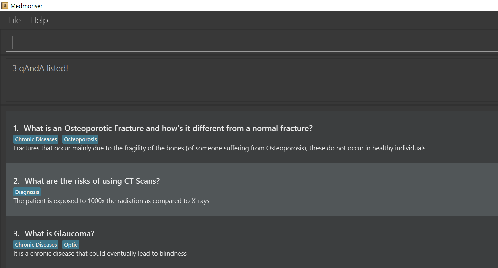
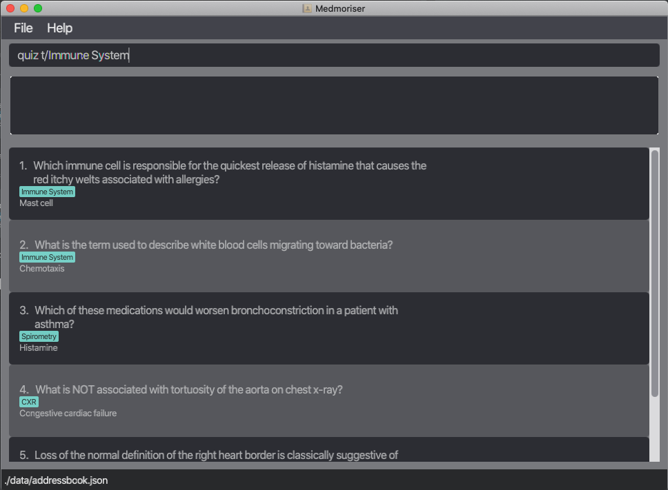
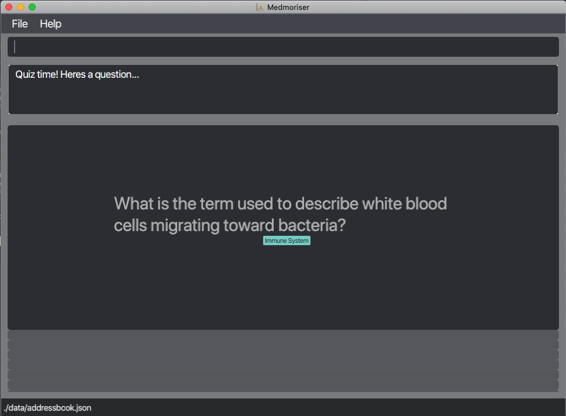

Hi Medical Student! Welcome to the User Guide for **Medmoriser**!

**Medmoriser** is a desktop app to help medical students organize, memorise and revise their content.

This guide aims to orientate you to the features of **Medmoriser**. If you're looking for a quiz
management system, this guide will give you all the information you need to get started with **Medmoriser**.

* Table of Contents
{:toc}

--------------------------------------------------------------------------------------------------------------------

## Features

**:information_source: Notes about the command format:** 

* Words in `UPPER_CASE` are the parameters to be supplied by the user. 
  e.g. in `add q/QUESTION`, `QUESTION` is a parameter which can be used as `add q/What is the heart responsible for?`.

* Items in square brackets are optional. 
  e.g. `q/QUESTION [t/TAG]` can be used as `q/What is the heart responsible for t/cardiology` or as `q/What is the heart responsible for`.

* Items with `…`​ after them can be used multiple times including zero times. 
  e.g. `[t/TAG]…​` can be used as ` ` (i.e. 0 times), `t/heart`, `t/heart t/cardiology` etc.

* Parameters can be in any order. 
  e.g. if the command specifies `q/QUESTION a/ANSWER`, `a/ANSWER q/QUESTION` is also acceptable.

### Viewing help: `help`

If you need to view the help page, this command shows a message explaining how to access it.

Format: `help`

### Adding a qAndA: `add`

You can add a question and answer pair to the database.

Format: `add q/QUESTION a/ANSWER`

Examples:
* `add q/what organ system is the lungs part of? a/respiratory system?`
* `add q/what is the function of the heart? a/It's the muscle at the centre of your circulation system, pumping blood around your body as your heart beats. This blood sends oxygen and nutrients to all parts of your body, and carries away unwanted carbon dioxide and waste products.`

### Deleting a Q&A: `delete` 

You can delete a specified Q&A from the database.

Format: `delete INDEX`

* This allows you to delete the Q&A at the specified `INDEX`.
* The index refers to the index number shown in the displayed question list.

ℹ️ **Note:** The index **must be a positive integer** (1, 2, 3, ...) within the range of the number of QAndAs in the database.

Examples:

* `list` followed by `delete 2` deletes the 2nd Q&A in the question book.
* `find disease` followed by `delete 1` deletes the 1st question in the results of the `find` command.

### Listing all Questions & Answers: `list` (by: Jonathan Foo)

This shows you the entire database of questions and answers.

Format: `list [questions]`

* Just typing list will list all questions and answers
* Adding the `questions` parameter will list only the questions (i.e. hide the answers)

Examples:
* `list` will show all questions and answers
* `list questions` will only show all questions

### Editing a Q&A: `edit` 

You can make changes to an existing Q&A with this command.

Format: `edit INDEX [q/QUESTION] [a/ANSWER] [t/TAG]…​`

* This allows you to edit the Q&A at the specified `INDEX`. The index refers to the index number shown in the displayed question list. 
* Existing values will be updated to the input values.

ℹ️ **Notes about the edit command:**  

* When you edit the tags, the existing tags of the Q&A will be removed i.e adding of tags is not cumulative.
* You must provide at least one of the optional fields.
* The index **must be a positive integer** (1, 2, 3, ...) within the range of the number of QAndAs in the database.

💡 **Tip:** You can remove all the QAndA's tags by typing `t/` without specifying any tags after it.

Examples:

*  `edit 1 a/To pump blood` Edits the answer the 1st question to be `To pump blood`.
*  `edit 2 q/What is the heart t/` Edits the question of the 2nd Q&A to be `What is the heart` and clears all existing tags.
### Locating questions/answers/tags by keywords: `find` (by: Yong Ming Yang)

If you would like to search the database, you can do so in a few ways:

> **TIP**
>
> `PHRASE` refers to words with spaces in between, for example: "nervous system"

1. Find Q&A with **questions** containing any of the given keywords.

    Format: `find q/KEYWORD`, for 2 or more words: `find q/PHRASE 1, KEYWORD1`

2. Find Q&A with **answers** containing any of the given keywords.

    Format: `find a/KEYWORD`, for 2 or more words: `find q/PHRASE 1, KEYWORD1`

3. Find Q&A with **tags** containing any of the given keywords.
    Keywords for tags can also have phrases, however this requires the text to have an exact match (case-insensitive).

    Format: `find t/KEYWORD`, for 2 or more words: `find q/PHRASE1, KEYWORD1`

4. Find Q&A with **questions or answers** containing any of the given keywords.

    Format: `find KEYWORD`, for 2 or more words: `find PHRASE, KEYWORD1`

Examples:
* `find q/system, disease` - finds questions containing the word "system" and/or "disease".
* `find a/vessels, chronic disease` - finds answers containing the word vessels, and/or the phrase "chronic disease".
* `find t/anatomy, Nervous System` - finds question sets tagged with the word "anatomy" and/or "Nervous System" (can be both), requires exact match of words (case-insensitive).
* `find infection, nervous system` - finds question and/or answers containing the word "infection", and/or the phrase "nervous system"

How it should look like in the application:

Expected Result:

The input `find t/Chronic diseases, Diagnosis` will return the questions with the tag "Chronic Diseases" and/or "Diagnosis"
as shown.
### Clearing all entries: `clear`

If you want to reset the database, this command helps to clear all entries from the question book.

Format: `clear`

### Quiz yourself on a question: `quiz` (by: Joshua Tan)

You will be able to test yourself on your knowledge from the questions that you added into the application.
Medmoriser will then randomly select a question to quiz you based on the keywords you provided.

1. Quiz a Q&A with **questions** containing any of the given keywords.

    Format: `quiz q/KEYWORD`, for 2 or more words: `quiz q/PHRASE 1, KEYWORD 1`

2. Quiz a Q&A wih **tag** containing any of the given keywords.

    Format: `quiz t/KEYWORD`, for 2 or more words: `quiz t/PHRASE 1, KEYWORD 1`

3. Quiz a Q&A with **questions or answers** containing any of the given keywords.

    Format: `quiz KEYWORD`, for 2 or more words: `quiz PHRASE 1, KEYWORD 1`
    
Examples:
* `quiz q/immunology` - randomly quizzes a question containing the word "immunology".
* `quiz t/surgery, injuries` - randomly quizzes a question that was tagged with the word "surgery" and/or "injuries" (can be both), requires exact match of words (case-insensitive).
* `quiz medicinal` - randomly quizzes a question and/or answer containing the keyword medicinal.

How it should look like in the application:

Expected Result:

### Answering a quiz question: `answer` (by: Joshua Tan)
You will be able to key in your answer for a quiz question:

Format: `answer YOUR_ANSWER`

### Exiting a quiz: `exitquiz` (by: Joshua Tan)
Once you are done with a quiz and have finished comparing your input answer with the answer in the question, you have to exit the quiz to run other commands.
If you want to run other commands in the midst of a quiz(ie. if you have not answered the question) you have to exit the quiz first:

Format: `exitquiz`

### Exiting the program: `exit`

If you're done with your work, this command allows you to exit the program.

Format: `exit`

### Saving the data

You don't need to worry about saving data manually, as Medmoriser data is automatically saved in the hard disk after any command that changes the data.

### Archiving data files [Coming Soon]

If you don't need certain questions anymore, you can archive them to declutter your workspace.

--------------------------------------------------------------------------------------------------------------------

## FAQ

**Q**: How do I transfer my data to another Computer? 
**A**: Install the app in the other computer and overwrite the empty data file it creates with the file that contains the data of your previous Medmoriser home folder.

--------------------------------------------------------------------------------------------------------------------

## Command summary

Action | Format, Examples
--------|------------------
**Add** | `add q/QUESTION a/ANSWER [t/TAG]…​`   e.g. `add q/What does the heart do a/Pump blood t/heart t/cardiology`
**Delete** | `delete INDEX`  e.g. `delete 3`
**List** | `list [questions]`
**Edit** | `edit INDEX [q/QUESTION] [a/ANSWER] [t/TAG]…​`   e.g. `edit 1 a/Maintain blood pressure t/cardiology`
**Find** | `find KEYWORD or [q/QUESTION_KEYWORD] or [a/ANSWER_KEYWORD] or [t/TAG_KEYWORD]`   e.g. `find system, or find a/answer1, answer 2`
**Quiz** | `quiz KEYWORD or [q/QUESTION_KEYWORD] or [t/TAG_KEYWORD]`   e.g. `quiz xray, or quiz t/Immune System`
**Answer** | `answer YOUR_ANSWER` 
**Exit Quiz** | `exitquiz`
**Clear** | `clear`
**Help** | `help`
**Exit** | `exit`

